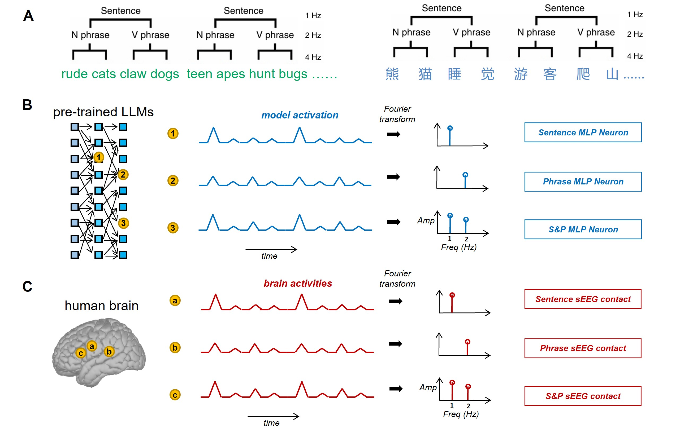

# Hierarchical Frequency Tagging Probe (HFTP): A Unified Approach to Investigate Syntactic Structure Representations in Large Language Models and the Human Brain

## Overview



HFTP (Hierarchical Frequency Tagging Probe), published at NeurIPS 2025, investigates syntactic structure processing in large language models (LLMs) and analyzes their alignment with human brain neural activity. This repository contains code and data for analyzing syntactic neuron representations across different neural network architectures and comparing them with human neurological responses using stereoelectroencephalography (sEEG) data.

## Project Structure

```
HFTP/
├── data/                           # Experimental datasets
├── correlation.py                  # Model-Brain alignment analysis
├── LLM_synactic_corpus.py          # Syntactic corpus analysis for LLMs (Llama 2 implementation provided)
├── definitions.py                  # Utility functions and definitions
└── README.md                       # This file
```

## Data Description

The `data/` directory contains experimental datasets for syntactic analysis in LLMs. For Model-Brain alignment experiments, we use hierarchical linguistic stimuli from ["The cortical maps of hierarchical linguistic structures during speech perception"](https://doi.org/10.1093/cercor/bhy191). These alignment stimuli follow a similar syntactic structure to the Chinese syntactic corpus (four-syllable sentences) but differ in semantic content.

### Syntactic Corpora
- **`Chinese_syntactic_corpus.csv`**: Chinese four-syllable syntactic corpus designed for extracting syntactic neural representations in LLMs
  - **Example**: "老牛耕地", "朋友请客"

- **`English_syntactic_corpus.csv`**: English four-word syntactic corpus with parallel design for cross-linguistic syntactic analysis
  - **Example**: "fat rat sensed fear", "wood shelf holds cans"

### Natural Language Corpora

#### Chinese Natural Language Data
- **`Chinese_8-natural.csv`**: 8-character Chinese natural language corpus containing diverse text types including everyday dialogue, news reports, literary excerpts, and poetry
  - **Example**: "森林火势得到控制。", "列车准点抵达站台。"

- **`Chinese_9-natural.csv`**: 9-character Chinese natural language corpus with extended samples for frequency analysis, covering the same text types as the 8-character corpus
  - **Example**: "临床试验数据公布了。", "姐姐，这裙子有蓝色吗？"

- **`Chinese_8-zhwiki.csv`**: 8-character Chinese Wikipedia corpus providing encyclopedia-style natural language data extracted from Chinese Wikipedia articles
  - **Example**: "这个发现归功于他。", "人身牛首，長於姜水。"

#### English Natural Language Data
- **`English_8-naturale.csv`**: 8-word English natural language corpus containing everyday dialogue, news reports, and literary prose
  - **Example**: "With malice toward none, with charity toward all.", ""Tonight, shall we watch the meteor shower together?""

- **`English_9-naturale.csv`**: 9-word English natural language corpus with extended samples, designed parallel to the Chinese 9-character corpus
  - **Example**: "Clinical trial data were publicly released this morning nationwide.", "Shall we share sushi together tonight by the river?"

- **`English_8-enwiki.csv`**: 8-word English Wikipedia corpus extracted from English Wikipedia articles, serving as the counterpart to the Chinese Wikipedia corpus
  - **Example**: "World and Its Peoples: Eastern and Southern Asia.", "Cognitive systems engineering: New wine in new bottles."

## Running HFTP experiments

We provide three main analysis scripts for syntactic representation extraction, statistical analysis, and brain-model alignment correlation.

### Syntactic Analysis with LLMs

**`LLM_synactic_corpus.py`**: Extracts syntactic representations from LLMs and identifies three types of syntactic neurons (sentence-level, phrase-level, and shared) through frequency analysis and statistical testing. Includes control conditions via sentence shuffling.

**Note**: This code includes Llama 2 model implementation as an example. To run syntactic analysis on other models, simply modify the MLP layer activation extraction method in the `process_text_and_accumulate_activations()` function and adapt your model paths. Refer to `correlation.py` for examples of other model architectures.

**`definitions.py`**: Utility functions for statistical analysis including permutation testing, z-score analysis, significance testing, and visualization functions for plotting syntactic neuron distributions across layers.

### Model-Brain Alignment Analysis

**`correlation.py`**: Performs Representational Similarity Analysis (RSA) between language model representations and brain activity data. Supports multiple model architectures (GPT-2, Llama, Gemma, GLM) and analyzes alignment patterns across brain hemispheres and regions.

**Output Files**:

1. **HDF5 Files** (`*.hdf5`): Store neural activation data and sEEG ITPC (Inter-Trial Phase Coherence) results for efficient data access and processing across experimental blocks.

2. **Significance Analysis CSV Files**:
   - `*_significant_neurons.csv`: Contains identified significant neurons with z-score analysis results, neuron indices, and statistical significance measures
   - `*_permutation_neurons.csv`: Results from permutation testing showing validated significant patterns across different conditions

3. **Correlation Analysis CSV Files**:
   - `*_search_light.csv`: Layer-wise correlation ratios between model representations and brain regions, providing spatial mapping of model-brain alignment
   - `*_spearman.csv`: Detailed Spearman correlation coefficients between model layers and individual brain channels. The top-100 correlations per layer are averaged, then averaged across layers and neuron types (sentence, phrase, shared) to compute the overall Model-Brain similarity score $S(m,b)$
   - `*_similarity.csv`: Model-Region similarity scores $S(m,b_r)$ quantifying the alignment between model representations and brain activity patterns across anatomical regions (A1, STG, MTG, ITG, Insula, etc.) for both hemispheres


## Usage

### 1. Install Dependencies
```bash
pip install -r requirements.txt
```

### 2. Syntactic Analysis with Llama 2

```python
# Configure model and data paths
BASE_MODEL_PATH = 'models/Llama2'
BASE_OUTPUT_PATH = 'Results/Llama2'
input_dir = 'data'

# Run analysis
python Llama2_synactic_corpus.py
```

Running this analysis will use the HFTP probe to extract MLP layer activations from the model and identify the distribution of syntactic neurons across different layers.

### 3. Model-Brain Alignment Analysis

```python
# Configure paths
activation_data_dir = 'Results/correlation/activations'
output_dir = 'Results/correlation'

# Run correlation analysis
python correlation_neurips.py
```

Running this analysis will use the HFTP probe to identify syntactic neurons across model layers and generate correlation analysis results including search light mappings, Spearman correlations, channel distributions, and regional similarity scores.

## Results and Applications

This framework enables:
1. **Identification of syntactic neurons** in transformer-based LLMs
2. **Cross-linguistic layer-wise analysis** of hierarchical syntactic structure representations
3. **Quantification of brain-model alignment** in syntactic processing

## Citation

If you use this code or data in your research, please cite the associated publication.


## Contact

[Add contact information for questions or collaboration]


